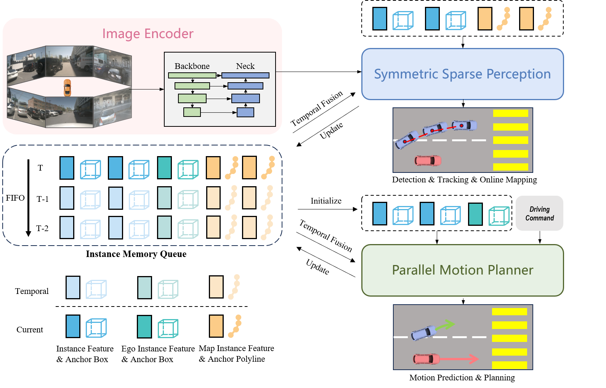
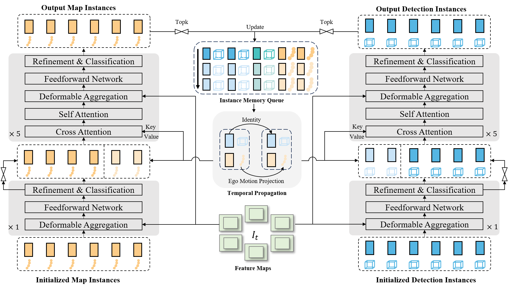
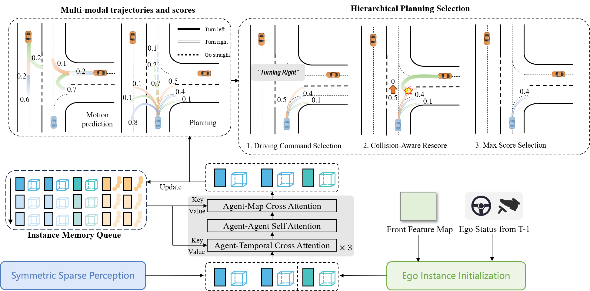

# SparseDrive: End-to-End Autonomous Driving via Sparse Scene Representation

https://github.com/swc-17/SparseDrive/assets/64842878/867276dc-7c19-4e01-9a8e-81c4ed844745

## News
* **`31 May, 2024`:** We release the SparseDrive paper on [arXiv](https://arxiv.org/abs/2405.19620).


## Introduction
> SparseDrive is a Sparse-Centric paradigm for end-to-end autonomous driving.
- We explore the sparse scene representation for end-to-end autonomous driving and propose a Sparse-Centric paradigm named SparseDrive, which unifies multiple tasks with sparse instance representation.
- We revise the great similarity shared between motion prediction and planning, correspondingly leading to a parallel design for motion planner. We further propose a hierarchical planning selection strategy incorporating a collision-aware rescore module to boost the planning performance.
- On the challenging nuScenes benchmark, SparseDrive surpasses previous SOTA methods in terms of all metrics, especially the safety-critical metric collision rate, while keeping much higher training and inference efficiency.

<center>
    
    <br>
    <div style="color:orange; border-bottom: 1px solid #d9d9d9;
    display: inline-block;
    color: #999;
    padding: 2px;">Overview of SparseDrive. SparseDrive first encodes multi-view images into feature maps,
    then learns sparse scene representation through symmetric sparse perception, and finally perform
    motion prediction and planning in a parallel manner. An instance memory queue is devised for
    temporal modeling.</div>
</center>
<center>
    
    <br>
    <div style="color:orange; border-bottom: 1px solid #d9d9d9;
    display: inline-block;
    color: #999;
    padding: 2px;">Model architecture of symmetric sparse perception, which unifies detection, tracking and
    online mapping in a symmetric structure.</div>
</center>
<center>
    
    <br>
    <div style="color:orange; border-bottom: 1px solid #d9d9d9;
    display: inline-block;
    color: #999;
    padding: 2px;">Model structure of parallel motion planner, which performs motion prediction and planning
    simultaneously and outputs safe planning trajectory.</div>
</center>

## Results

- Comprehensive results for all tasks on [nuScenes](https://github.com/nutonomy/nuscenes-devkit).

| Method | NDS | AMOTA | minADE (m) | L2 (m) Avg | Col. (%) Avg | Training Time (h) | FPS |
| :---: | :---:| :---: | :---: | :---: | :---: | :---: | :---: |
| UniAD | 0.498 | 0.359 | 0.71 | 0.73 | 0.61 | 144 | 1.8 |
| SparseDrive-S | 0.525 | 0.386 | 0.62 | 0.61 | 0.08 | **20** | **9.0** |
| SparseDrive-B | **0.588** | **0.501** | **0.60** | **0.58** | **0.06** | 30 | 7.3 |

- Open-loop planning results on [nuScenes](https://github.com/nutonomy/nuscenes-devkit).

| Method | L2 (m) 1s | L2 (m) 2s | L2 (m) 3s | L2 (m) Avg | Col. (%) 1s | Col. (%) 2s | Col. (%) 3s | Col. (%) Avg | FPS |
| :---: | :---: | :---: | :---: | :---:| :---: | :---: | :---: | :---: | :---: |
| UniAD | 0.45 | 0.70 | 1.04 | 0.73 | 0.62 | 0.58 | 0.63 | 0.61 | 1.8 |
| VAD | 0.41 | 0.70 | 1.05 | 0.72 | 0.03 | 0.19 | 0.43 | 0.21 |4.5 |
| SparseDrive-S | **0.29** | 0.58 | 0.96 | 0.61 | 0.01 | 0.05 | 0.18 | 0.08 | **9.0** |
| SparseDrive-B | **0.29** | **0.55** | **0.91** | **0.58** | **0.01** | **0.02** | **0.13** | **0.06** | 7.3 |


## Citation
If you find SparseDrive useful in your research or applications, please consider giving us a star &#127775; and citing it by the following BibTeX entry.
```
```

## Acknowledgement
- [Sparse4D](https://github.com/HorizonRobotics/Sparse4D)
- [mmdet3d](https://github.com/open-mmlab/mmdetection3d)
- [UniAD](https://github.com/OpenDriveLab/UniAD) 
- [VAD](https://github.com/hustvl/VAD)
- [StreamPETR](https://github.com/exiawsh/StreamPETR)

