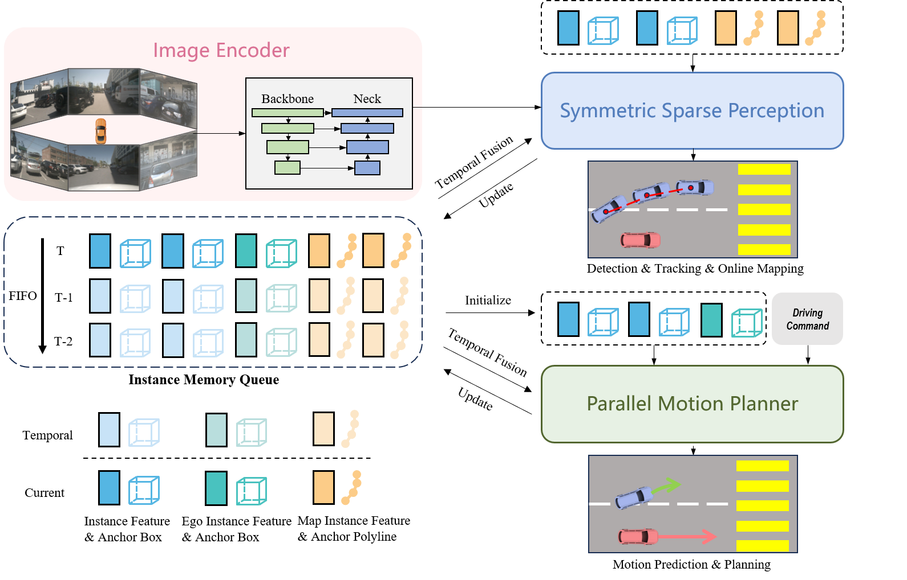
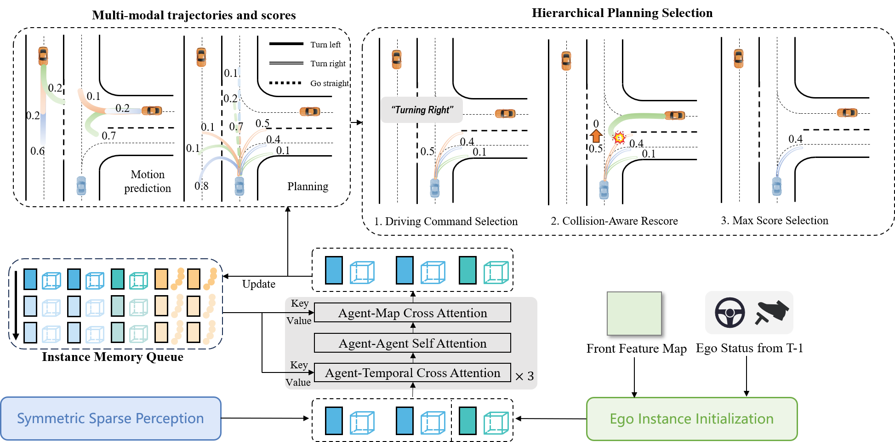

# SparseDrive V1 / V1.5 — geometry-only planner fork

Fork of [swc-17/SparseDrive](https://github.com/swc-17/SparseDrive) carrying one
load-bearing design change plus a NAVSIM port. The upstream README is preserved
[below](#upstream-readme).

## The design change: the planner reads geometry, not pixels

Stock SparseDrive feeds the planner image-derived instance features. Both models
here replace every one of those with an MLP encoding of the corresponding
geometry, and build no ego CNN at all:

- `geometric_inputs=True` substitutes `det_output/map_output["instance_feature"]`
  with encodings of the 11-d agent boxes (position, size, yaw, velocity) and the
  40-d map polylines, at the top of `MotionPlanningHead.forward` — before every
  consumer, including `InstanceQueue.prepare_motion`, so temporal history is
  geometry-derived too.
- `use_cam_ego_feature=False` means the ego CNN is never constructed (not merely
  unused). A constructor assert couples the two flags.

**V1** keeps the stock regression planner. **V1.5** swaps in a trajectory
vocabulary planner (`trajectory_vocab_planner.py`) that scores a fixed
trajectory vocabulary and re-ranks it by predicted metric score
(`pdm_metric_scorer.py`); it is likewise geometry-attention with no image reads.

Each domain ships an image-feature twin as the control that isolates this one
change: V6c on nuScenes, `imgfeat` on NAVSIM.

Scope caveat, stated plainly: *which* top-50 agents and top-10 polylines reach
the planner is still chosen by detection/map confidence, and the boxes and
polylines themselves come from the camera-based perception stack.
"Geometry-only" describes the planner's **inputs**, not the whole pipeline.

Provenance: the decision rests on the declutter experiment in
[docs/declutter_experiment_plan.md](docs/declutter_experiment_plan.md), where a
standalone geometric planner over frozen stage-1 perception (`geo_planner/`)
matched its image-feature control (L2 0.367 +/- 0.004 vs 0.361 +/- 0.010).

### The two flags

Both live under `model.head.motion_plan_head`. **Stock upstream default is
`geometric_inputs=False`**, i.e. image features, so geometry-only is opt-in.

| Flag | Geometry-only (V1, V1.5) | Image features (stock, controls) |
| --- | --- | --- |
| `geometric_inputs` | `True` | `False` (default) |
| `instance_queue.use_cam_ego_feature` | `False` | `True` (default) |

They are coupled, not independent. `MotionPlanningHead.__init__` asserts that
`geometric_inputs=True` implies `use_cam_ego_feature=False`, because leaving the
ego CNN built but unused creates DDP unused parameters. Set one and you must set
the other.

```python
# enable geometry-only (this is what stage2_v6_geoinput.py does)
model = dict(head=dict(motion_plan_head=dict(
    geometric_inputs=True,
    instance_queue=dict(use_cam_ego_feature=False),
)))
```

Or override at the command line without touching a config, which is how to turn
an existing geometry-only config back into its image-feature control:

```bash
--cfg-options \
  model.head.motion_plan_head.geometric_inputs=False \
  model.head.motion_plan_head.instance_queue.use_cam_ego_feature=True
```

One constraint specific to V1.5: the trajectory vocabulary planner **requires**
`geometric_inputs=True` and raises `ValueError: trajectory_vocab requires
geometric_inputs=True` otherwise, so V1.5 cannot be flipped to image features by
these flags alone. Its image-feature control is a separate model, not in this
tree; on NAVSIM the control for the geometry-only change is the V1 `imgfeat` run.

## Model zoo

All paths are absolute on the research box. `$LWM = /home/tejan/lwm-rl`,
`$S3 = s3://research-datasets-chicago/users/tejan`.

### nuScenes val — stock 10-class, 6-step, rescore-off

| Model | Planner input | Config | Checkpoint |
| --- | --- | --- | --- |
| Official SparseDrive stage2 | image features | [stage2_v6c_ctrl.py](projects/configs/declutter/stage2_v6c_ctrl.py) (eval only) | `$LWM/SparseDrive/ckpt/sparsedrive_stage2.pth` |
| **V1 geometry-only** (V6, seeds 0/1/2) | geometry | [stage2_v6_geoinput.py](projects/configs/declutter/stage2_v6_geoinput.py) | `$LWM/SparseDrive/work_dirs/stage2_v6_geoinput_seed{0,1,2}/iter_5860.pth` |
| V1 image-feature control (V6c) | image features | [stage2_v6c_ctrl.py](projects/configs/declutter/stage2_v6c_ctrl.py) | `$LWM/SparseDrive/work_dirs/stage2_v6c_ctrl_seed0/iter_5860.pth` |

S3 mirror: `$S3/sparsedrive/declutter/work_dirs_v2/<run>/iter_5860.pth`,
official at `$S3/sparsedrive/declutter/ckpt/sparsedrive_stage2.pth`.

### NAVSIM — navtrain 1,067-log split

| Model | Planner input | Config | Checkpoint |
| --- | --- | --- | --- |
| Official SparseDriveV2 | vocabulary, planning-only | external | `$LWM/SparseDriveV2/weights/sparsedrive_navsimv1_92p2.ckpt`, `sparsedrive_navsimv2_90p3.ckpt` |
| **V1 geometry-only** (A) | geometry | [..._stage2_geoinput_full.py](projects/configs/navsim/sparsedrive_navsim_stage2_geoinput_full.py) | `$LWM/SparseDrive/work_dirs/navsim_stage2_geoinput_full_16g/iter_8703.pth` |
| V1 image-feature control | image features | [..._stage2_imgfeat_full.py](projects/configs/navsim/sparsedrive_navsim_stage2_imgfeat_full.py) | `$LWM/SparseDrive/work_dirs/navsim_stage2_imgfeat_full_16g/iter_8703.pth` |
| **V1.5 vocabulary planner** | geometry | [..._stage2_vocab_metric_full.py](projects/configs/navsim/sparsedrive_navsim_stage2_vocab_metric_full.py) | `$LWM/.wtc/worktrees/sd1.5/SparseDrive/work_dirs/navsim_stage2_vocab_metric_16g/iter_8703.pth` |

S3 mirror: `$S3/navsim/sparsedrive/work_dirs/<run>/iter_8703.pth`.

SparseDriveV2 is an external baseline, not an ablation of this stack: it is
planning-only (no detection/map/motion heads, so its perception cells are N/A)
and trained on all 1,192 navtrain logs against our 1,067, roughly 12% more data.

## Data paths

| What | Path |
| --- | --- |
| nuScenes root | `data/nuscenes` -> `/media/applied/nuScenes` (`samples`, `sweeps`, `maps`, `v1.0-trainval`, `can_bus`) |
| nuScenes infos (6-step, map-annotated) | `data/infos/nuscenes_infos_{train,val}_withmap.pkl` |
| NAVSIM raw | `/media/applied/navsim` (`navsim_logs/`, `sensor_blobs/{mini,test,trainval}`, `maps/`, `navhard_two_stage/`) |
| NAVSIM infos | `data/infos/navsim_infos_{navtrain_full,navtest,navmini}.pkl` |
| Detection / map / motion / plan anchors | `data/kmeans/*.npy` |
| V1.5 trajectory vocabulary | `data/kmeans/sparsedrive_v2/{path_1024.npy,velocity_256.npy,trajectory_1024_256.npz}` |
| navtest metric caches (v1, v2) | `$LWM/SparseDriveV2/exp/metric_cache_navtest_v1`, `metric_cache_navtestv2` |
| navhard two-stage metric cache | `work_dirs/navsim_eval/metric_cache_navhard2s_full` |
| Geometry caches (`geo_planner/`) | `data/geometry_cache{,_v6,_v6b}` |

S3 mirrors: nuScenes keyframes `$S3/sparsedrive/declutter/data/sd_nuscenes.tar`,
nuScenes infos/anchors under `$S3/sparsedrive/declutter/data/`, NAVSIM infos,
anchors, frame tars and metric caches under `$S3/navsim/sparsedrive/`.

`SparseDriveV2` is a hard runtime dependency, not just a baseline: the NAVSIM
scorers import its `navsim` package and read its pinned metric caches. It must
sit at commit `94d01a6`.

## Training

Two envs, and they are not interchangeable: **`sparsedrive310`** has the mm-stack
and runs all training and inference; **`lilypad`** has the navsim/nuplan stack
and runs only NAVSIM scoring. No single env has both.

Always launch through `tools/train_pyfocal.py`, not `tools/train.py`. It swaps
mmcv's `sigmoid_focal_loss` CUDA extension for a numerically equivalent pure
PyTorch implementation, because the mmcv build here ships without that op. It
then delegates to `train.py` unchanged, so every flag is the same. Both local
and cluster runs go through this wrapper so they share one code path.

Training is two-stage, as upstream: stage 1 trains perception (detection, map,
tracking), stage 2 adds the motion and planning heads and initialises from the
stage-1 weights via `load_from`. **Stage 2 is where the geometry-only planner
lives; stage 1 is unaffected by these flags.**

```bash
conda activate sparsedrive310
SD=tools/train_pyfocal.py
```

### V1 on nuScenes (geometry-only)

Stage 2 only. It initialises from the official stage-1 checkpoint, so there is
no stage 1 to run yourself: place `ckpt/sparsedrive_stage1.pth` (the upstream
release) and go. 10 epochs x 586 iters = 5,860, giving `iter_5860.pth`.

```bash
# geometry-only (V1)
bash tools/dist_train.sh projects/configs/declutter/stage2_v6_geoinput.py 8

# image-feature control (V6c), same recipe, one flag pair different
bash tools/dist_train.sh projects/configs/declutter/stage2_v6c_ctrl.py 8
```

`dist_train.sh` takes `<config> <num_gpus>` and forwards any extra args to
`train.py`. To route it through the focal-loss wrapper instead, call it
directly:

```bash
python3 -m torch.distributed.launch --nproc_per_node=8 \
  tools/train_pyfocal.py projects/configs/declutter/stage2_v6_geoinput.py \
  --launcher pytorch
```

### V1 on NAVSIM (geometry-only)

Needs a NAVSIM stage 1 first, since no official NAVSIM stage-1 checkpoint
exists. Stage 1 is 16 GPUs at total batch 128; stage 2 is 3 epochs at total
batch 32, giving `iter_8703.pth`.

```bash
# stage 1 (perception on navtrain)
python3 -m torch.distributed.launch --nproc_per_node=16 \
  tools/train_pyfocal.py \
  projects/configs/navsim/sparsedrive_navsim_stage1_full_16g.py --launcher pytorch

# stage 2, geometry-only (A).  Point load_from at a stage-1 result; the
# already-trained one is work_dirs/navsim_stage1_eval/ckpts/.
python3 -m torch.distributed.launch --nproc_per_node=8 \
  tools/train_pyfocal.py \
  projects/configs/navsim/sparsedrive_navsim_stage2_geoinput_full.py \
  --launcher pytorch \
  --cfg-options load_from=work_dirs/navsim_stage1_eval/ckpts/navsim_stage1_full_16g_iter_21750.pth

# stage 2, image-feature control (imgfeat)
python3 -m torch.distributed.launch --nproc_per_node=8 \
  tools/train_pyfocal.py \
  projects/configs/navsim/sparsedrive_navsim_stage2_imgfeat_full.py \
  --launcher pytorch
```

### V1.5 on NAVSIM (trajectory vocabulary + metric head)

Same NAVSIM stage 1, then the vocabulary planner. Its config chain is
`vocab_metric_full` -> `vocab_full` -> `geoinput_full`, so it inherits the
geometry-only planner rather than re-declaring it. Stage 1 is read from
`$SPARSEDRIVE_STAGE1_CHECKPOINT` (a config default, not a CLI flag), and the
vocabulary anchors in `data/kmeans/sparsedrive_v2/` must be present.

```bash
# defaults to this same path inside the config; export only to override it
export SPARSEDRIVE_STAGE1_CHECKPOINT=$LWM/SparseDrive/work_dirs/navsim_stage1_eval/ckpts/navsim_stage1_full_16g_iter_21750.pth

# single node
python3 -m torch.distributed.launch --nproc_per_node=8 \
  tools/train_pyfocal.py \
  projects/configs/navsim/sparsedrive_navsim_stage2_vocab_metric_full.py \
  --launcher pytorch

# 2 nodes / 16 GPUs, same total batch 32, doubles CPU scoring throughput
# (the PDM metric head runs scoring pools per rank)
projects/configs/navsim/sparsedrive_navsim_stage2_vocab_metric_16g.py
```

`sparsedrive_navsim_stage2_vocab_full.py` is the vocabulary planner without the
metric re-ranking head; `vocab_metric_full` adds it. The shipped V1.5 checkpoint
is the metric variant.

## Evaluating

NAVSIM has three protocols; never mix their caches, since the v1 pickles
deserialize `navsim.navsim_v1.*` classes.

| Protocol | Script | Cache | Tokens |
| --- | --- | --- | --- |
| navtest v1 PDMS | `navsim_agent/score_pdm_v1.py` | `metric_cache_navtest_v1` | 12,146 |
| navtest v2 EPDMS | `navsim_agent/score_epdms_navtest_v2.py` | `metric_cache_navtestv2` | 12,146 |
| navhard two-stage EPDMS | `navsim_agent/score_epdms_two_stage.py` | `metric_cache_navhard2s_full` | 5,912 |

Inference runs in the `sparsedrive310` env, scoring in `lilypad`.

Reproduced numbers for everything below, checked against the values pinned
before the refactor, are in
[docs/sd_clean_reproduction_report.md](docs/sd_clean_reproduction_report.md).

### nuScenes: detection, map and planning in one pass

`tools/test.py <config> <checkpoint> --eval bbox`. The protocol that makes the
models comparable to the official checkpoint is 6-step, `withmap` infos, and
**rescore off** — collision rescoring is on by default upstream and inflates
planning, so leave it off for any comparison:

```bash
python tools/test.py \
  projects/configs/declutter/stage2_v6_geoinput.py \
  work_dirs/stage2_v6_geoinput_seed0/iter_5860.pth \
  --eval bbox --cfg-options \
    evaluation.eval_mode.with_det=True \
    evaluation.eval_mode.with_map=True \
    evaluation.eval_mode.with_planning=True \
    evaluation.eval_mode.with_tracking=False \
    evaluation.eval_mode.with_motion=False \
    model.head.motion_plan_head.planning_decoder.use_rescore=False
```

Evaluate the official checkpoint through `stage2_v6c_ctrl.py`: it is stock
architecture plus `withmap` infos, so it loads the released weights directly and
holds the eval protocol fixed.

Read the results from stdout or the run log, not from wandb. Detection prints
`mAP:` and `NDS:`, map prints per-class APs and the mean as `mAP_normal=`, and
planning prints `L2:` and `obj_box_col:`. The cluster driver's scraper captures
only the planning table, so det/map are log-only.

Multi-GPU: `bash tools/dist_test.sh <config> <checkpoint> <num_gpus>`.

### NAVSIM: inference, then scoring

Two steps in two envs. Inference writes a trajectory pickle; scoring consumes it.
This split is why a failed scoring run never costs you the GPU time.

```bash
# 1. inference (sparsedrive310).  --frames for navhard, --infos for navtest.
python -m navsim_agent.run_inference_frames \
  --config projects/configs/navsim/sparsedrive_navsim_stage2_geoinput_full.py \
  --checkpoint work_dirs/navsim_stage2_geoinput_full_16g/iter_8703.pth \
  --frames work_dirs/navsim_eval/frames_navhard2s.pkl \
  --output work_dirs/navsim_eval/trajs_a_navhard2s.pkl

# 2. scoring (lilypad env), one of the three protocols
python navsim_agent/score_epdms_two_stage.py \
  --agent traj:$PWD/work_dirs/navsim_eval/trajs_a_navhard2s.pkl \
  --split navhard_two_stage \
  --metric-cache $PWD/work_dirs/navsim_eval/metric_cache_navhard2s_full \
  --worker ray_distributed_no_torch \
  --run-tag a_navhard2s
```

`--agent` also takes `human` or `constant_velocity` for sanity baselines. Add
`--require-epdms --expected-tokens N` to fail closed rather than silently score a
partial run. Workers: `sequential` is deterministic and fine at navmini scale,
`ray_distributed_no_torch` for full navtest/navhard.

For the two columns that already have wired scripts:

```bash
bash lilypad_config/navsim_eval/score_navhard_local.sh
bash lilypad_config/navsim_eval/score_navtest_v2_local.sh
```

### On the cluster

```bash
bash lilypad_config/navsim_eval/submit.sh evalclean_
```

Each job uploads the tree at `runtime_environment.code_assets.root_directory`,
so that key is what points the cluster at a given worktree. nuScenes evals go
through `lilypad_entrypoint_nuscenes.eval_entrypoint_fn` (N parallel
`tools/test.py` runs, one per GPU); NAVSIM through
`lilypad_entrypoint_navsim.eval_entrypoint_fn`.

Two things that will bite otherwise:

- Declare `num_gpus` inside `entrypoint_fn_config`, not only under
  `cluster_resources`. The eval driver reads it from the config block with a
  default of 1, so any `num_shards > 1` dies in validation before staging with
  `num_shards must be between one and num_gpus`.
- **Only navtest v1 PDMS scores on the cluster.** navhard scoring calls
  `ray.init()` with explicit resources inside the job's own Ray cluster and dies
  with `When connecting to an existing cluster, num_cpus and num_gpus must not be
  provided`; navtest v2 has no cluster mode at all. For both, let the cluster do
  inference and score locally from the exported trajectories, which takes about
  5 minutes per model.

---

# Upstream README

# SparseDrive: End-to-End Autonomous Driving via Sparse Scene Representation

https://github.com/swc-17/SparseDrive/assets/64842878/867276dc-7c19-4e01-9a8e-81c4ed844745

## News
* **`1 April, 2026`:** Our following work SparseDriveV2 is released. [arxiv](https://arxiv.org/abs/2603.29163), [Code](https://github.com/swc-17/SparseDriveV2).
* **`17 March, 2025`:** SparseDrive is accepted by ICRA 2025.
* **`24 June, 2024`:** We reorganize code for better readability. Code & Models are released.
* **`31 May, 2024`:** We release the SparseDrive paper on [arXiv](https://arxiv.org/abs/2405.19620). Code & Models will be released in June, 2024. Please stay tuned!


## Introduction
> SparseDrive is a Sparse-Centric paradigm for end-to-end autonomous driving.
- We explore the sparse scene representation for end-to-end autonomous driving and propose a Sparse-Centric paradigm named SparseDrive, which unifies multiple tasks with sparse instance representation.
- We revise the great similarity shared between motion prediction and planning, correspondingly leading to a parallel design for motion planner. We further propose a hierarchical planning selection strategy incorporating a collision-aware rescore module to boost the planning performance.
- On the challenging nuScenes benchmark, SparseDrive surpasses previous SOTA methods in terms of all metrics, especially the safety-critical metric collision rate, while keeping much higher training and inference efficiency.

<center>
    
    <br>
    <div style="color:orange; border-bottom: 1px solid #d9d9d9;
    display: inline-block;
    color: #999;
    padding: 2px;">Overview of SparseDrive. SparseDrive first encodes multi-view images into feature maps,
    then learns sparse scene representation through symmetric sparse perception, and finally perform
    motion prediction and planning in a parallel manner. An instance memory queue is devised for
    temporal modeling.</div>
</center>
<center>
    
    <br>
    <div style="color:orange; border-bottom: 1px solid #d9d9d9;
    display: inline-block;
    color: #999;
    padding: 2px;">Model architecture of symmetric sparse perception, which unifies detection, tracking and
    online mapping in a symmetric structure.</div>
</center>
<center>
    
    <br>
    <div style="color:orange; border-bottom: 1px solid #d9d9d9;
    display: inline-block;
    color: #999;
    padding: 2px;">Model structure of parallel motion planner, which performs motion prediction and planning
    simultaneously and outputs safe planning trajectory.</div>
</center>

## Results in paper

- Comprehensive results for all tasks on [nuScenes](https://github.com/nutonomy/nuscenes-devkit).

| Method | NDS | AMOTA | minADE (m) | L2 (m) Avg | Col. (%) Avg | Training Time (h) | FPS |
| :---: | :---:| :---: | :---: | :---: | :---: | :---: | :---: |
| UniAD | 0.498 | 0.359 | 0.71 | 0.73 | 0.61 | 144 | 1.8 |
| SparseDrive-S | 0.525 | 0.386 | 0.62 | 0.61 | 0.08 | **20** | **9.0** |
| SparseDrive-B | **0.588** | **0.501** | **0.60** | **0.58** | **0.06** | 30 | 7.3 |

- Open-loop planning results on [nuScenes](https://github.com/nutonomy/nuscenes-devkit).

| Method | L2 (m) 1s | L2 (m) 2s | L2 (m) 3s | L2 (m) Avg | Col. (%) 1s | Col. (%) 2s | Col. (%) 3s | Col. (%) Avg | FPS |
| :---: | :---: | :---: | :---: | :---:| :---: | :---: | :---: | :---: | :---: |
| UniAD | 0.45 | 0.70 | 1.04 | 0.73 | 0.62 | 0.58 | 0.63 | 0.61 | 1.8 |
| VAD | 0.41 | 0.70 | 1.05 | 0.72 | 0.03 | 0.19 | 0.43 | 0.21 |4.5 |
| SparseDrive-S | **0.29** | 0.58 | 0.96 | 0.61 | 0.01 | 0.05 | 0.18 | 0.08 | **9.0** |
| SparseDrive-B | **0.29** | **0.55** | **0.91** | **0.58** | **0.01** | **0.02** | **0.13** | **0.06** | 7.3 |

## Results of released checkpoint
We found that some collision cases were not taken into consideration in our previous code, so we re-implement the evaluation metric for collision rate in released code and provide updated results.

## Main results
| Model | config | ckpt | log | det: NDS | mapping: mAP | track: AMOTA |track: AMOTP | motion: EPA_car |motion: minADE_car| motion: minFDE_car | motion: MissRate_car | planning: CR | planning: L2 |
| :---: | :---: | :---: | :---: | :---: | :---:|:---:|:---: | :---: | :----: | :----: | :----: | :----: | :----: |
| Stage1 |[cfg](projects/configs/sparsedrive_small_stage1.py)|[ckpt](https://github.com/swc-17/SparseDrive/releases/download/v1.0/sparsedrive_stage1.pth)|[log](https://github.com/swc-17/SparseDrive/releases/download/v1.0/sparsedrive_stage1_log.txt)|0.5260|0.5689|0.385|1.260| | | | | | |
| Stage2 |[cfg](projects/configs/sparsedrive_small_stage2.py)|[ckpt](https://github.com/swc-17/SparseDrive/releases/download/v1.0/sparsedrive_stage2.pth)|[log](https://github.com/swc-17/SparseDrive/releases/download/v1.0/sparsedrive_stage2_log.txt)|0.5257|0.5656|0.372|1.248|0.492|0.61|0.95|0.133|0.097%|0.61|

## Detailed results for planning
| Method | L2 (m) 1s | L2 (m) 2s | L2 (m) 3s | L2 (m) Avg | Col. (%) 1s | Col. (%) 2s | Col. (%) 3s | Col. (%) Avg |
| :---: | :---: | :---: | :---: | :---: | :---: | :---: | :---: | :---: |
| UniAD | 0.45 | 0.70 | 1.04 | 0.73 | 0.66 | 0.66 | 0.72 | 0.68 |
| UniAD-wo-post-optim | 0.32 | 0.58 | 0.94 | 0.61 | 0.17 | 0.27 | 0.42 | 0.29 |
| VAD | 0.41 | 0.70 | 1.05 | 0.72 | 0.03 | 0.21 | 0.49 | 0.24 | 
| SparseDrive-S | 0.30 | 0.58 | 0.95 | 0.61 | 0.01 | 0.05 | 0.23 | 0.10 | 


## Quick Start
[Quick Start](docs/quick_start.md)

## Citation
If you find SparseDrive useful in your research or applications, please consider giving us a star &#127775; and citing it by the following BibTeX entry.
```
@inproceedings{sun2025sparsedrive,
  title={Sparsedrive: End-to-end autonomous driving via sparse scene representation},
  author={Sun, Wenchao and Lin, Xuewu and Shi, Yining and Zhang, Chuang and Wu, Haoran and Zheng, Sifa},
  booktitle={2025 IEEE International Conference on Robotics and Automation (ICRA)},
  pages={8795--8801},
  year={2025},
  organization={IEEE}
}
```

## Acknowledgement
- [Sparse4D](https://github.com/HorizonRobotics/Sparse4D)
- [UniAD](https://github.com/OpenDriveLab/UniAD) 
- [VAD](https://github.com/hustvl/VAD)
- [StreamPETR](https://github.com/exiawsh/StreamPETR)
- [StreamMapNet](https://github.com/yuantianyuan01/StreamMapNet)
- [mmdet3d](https://github.com/open-mmlab/mmdetection3d)

